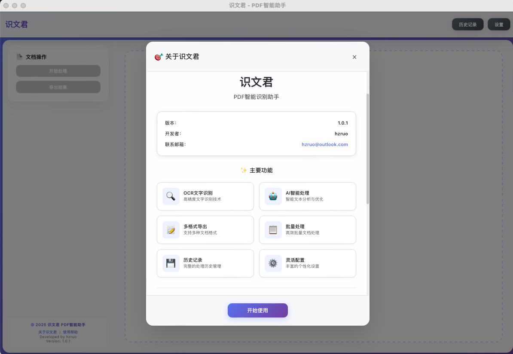

# 识文君 - PDF智能识别助手

基于AI技术的PDF文字识别工具，让文档处理更智能、更高效。

>文档地址：
>- https://pdfseer.netlify.app/
>- https://pdfseer.edgeone.app/

## ✨ 主要功能

- 🔍 **OCR文字识别**：高精度识别PDF文档中的文字内容，支持多种AI模型
- 🤖 **AI智能处理**：智能文本分析与优化，自动改进格式
- 📝 **多格式导出**：支持TXT、Markdown、Word、HTML、RTF等格式
- 📋 **批量处理**：高效批量文档处理，支持多页面同时识别
- 💾 **历史记录**：完整的处理历史管理，随时查看和重新处理
- ⚙️ **灵活配置**：支持多种AI服务配置和自定义选项

## 🎯 核心优势

- **高精度识别**：基于先进视觉语言模型，识别准确率高达95%+
- **多AI模型支持**：灵活选择最适合的AI服务，成本可控
- **专业PDF处理**：针对PDF文档优化，完美处理复杂排版
- **智能格式保持**：自动识别表格、列表等结构，保持原始格式
- **批量高效处理**：支持大量文档的自动化处理

## 🛠️ 技术栈

- 后端：Go 1.23+、Wails v2、pdfcpu、libvips
- 前端：Vue 3、TypeScript、Vite、TailwindCSS
- 桌面：跨平台（macOS/Windows/Linux）

## 🚀 快速体验

1. [下载应用](https://github.com/hzruo/pdfSeer/releases) 并安装
2. 配置您的AI服务（支持多种选择）
3. 拖拽PDF文件开始识别
4. 编辑结果并导出为所需格式

## 📞 获取帮助
- 📖 [使用指南](/docs/guide/getting-started) - 详细的使用说明
- 🎬 [视频教程](/docs/tutorial/video-tutorials.md)
- ❓ [常见问题](/docs/faq/) - 快速解决常见问题
- 📧 [联系我们](mailto:hzruo@outlook.com) - 技术支持和建议反馈
- ⚖️ [许可协议](/docs/about/license) - 使用条款和许可信息

---

让PDF文档处理更智能、更高效！

© 2025 识文君 - PDF智能助手 | 个人免费使用，不得二次售卖
